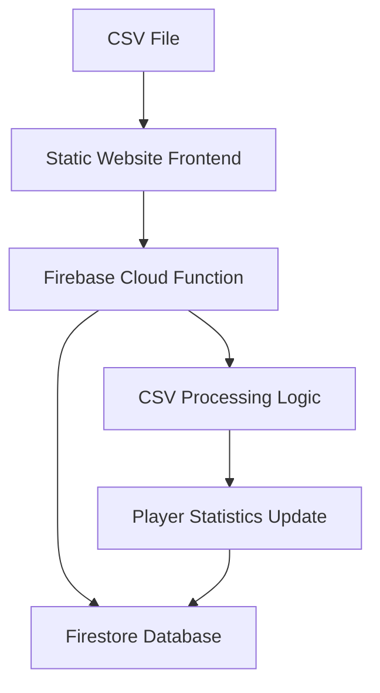

# Design Document

## Overview

This design outlines the implementation of a cloud database integration system that enables CSV file uploads through a static website frontend and processes them to update a Firebase Firestore database. The solution addresses the constraint of static website hosting by using Firebase Cloud Functions as a serverless backend to handle CSV processing and database updates.

The system will maintain the existing CSV processing logic from the current `Poker` class while adapting it to work with Firestore instead of the local JSON file. A web-based file upload interface will allow administrators to upload CSV files, which will be processed by a Cloud Function that replicates the current game addition workflow.

## Architecture

### High-Level Architecture



### Component Overview

1. **Frontend Upload Interface**: A web form on the static site for CSV file selection and upload
2. **Firebase Cloud Function**: Serverless function that receives CSV data and processes it
3. **CSV Processing Service**: Adapted logic from the existing `Poker` class for cloud database operations
4. **Firestore Database**: Cloud database storing player data and game records
5. **Response Handler**: Frontend component to display processing results and errors

### Data Flow

1. User selects CSV file through web interface
2. Frontend reads file content and sends to Cloud Function via HTTP request
3. Cloud Function validates CSV format and extracts game data
4. Processing service calculates player statistics and updates Firestore
5. Cloud Function returns success/error response to frontend
6. Frontend displays result to user

## Components and Interfaces

### Frontend Upload Component

**File**: `csv-upload.js` (new component)

**Responsibilities**:
- Provide file selection interface
- Validate file format client-side
- Read CSV file content
- Send file data to Cloud Function
- Display processing results

**Key Methods**:
- `handleFileSelection()`: Process selected CSV file
- `validateCSVFormat()`: Basic client-side validation
- `uploadCSVData()`: Send data to Cloud Function
- `displayResult()`: Show success/error messages

### Firebase Cloud Function

**Function Name**: `processCsvGame`

**Responsibilities**:
- Receive CSV data from frontend
- Validate and parse CSV content
- Process game data using adapted Poker logic
- Update Firestore database
- Return processing results

**Input**: HTTP POST request with CSV data
**Output**: JSON response with success/error status

### Cloud Poker Service

**File**: `cloud_poker.py` (adapted from existing `poker.py`)

**Responsibilities**:
- Connect to Firestore database
- Process CSV game data
- Calculate player statistics
- Update player records in Firestore
- Handle database transactions

**Key Methods**:
- `connect_to_firestore()`: Establish database connection
- `process_csv_game()`: Main processing logic
- `update_player_stats()`: Update individual player data
- `validate_players()`: Check if all players exist in database

### Database Schema

**Firestore Collections**:

1. **players** collection:
   - Document ID: Player name
   - Fields: All existing player data (net, games_played, statistics, etc.)

2. **ledgers** collection:
   - Document ID: Game date/identifier
   - Fields: Game session data with player results

## Data Models

### CSV Input Format
```csv
player_nickname,net,other_fields...
player1,1500,additional_data
player2,-500,additional_data
```

### Firestore Player Document
```json
{
  "id": 1,
  "flag": "flags/country.png",
  "putr": 13.12,
  "net": 976.14,
  "player_id": "unique_id",
  "biggest_win": 87.11,
  "biggest_loss": -70.0,
  "player_nicknames": ["nick1", "nick2"],
  "games_played": ["23_09_26", "23_09_29"],
  "net_dictionary": {"01_01": 0, "23_09_26": -40.0}
}
```

### Cloud Function Request/Response
```json
// Request
{
  "csvData": "player_nickname,net\nplayer1,1500\nplayer2,-500",
  "gameDate": "25_07_16"
}

// Response
{
  "success": true,
  "message": "Game added successfully",
  "playersUpdated": ["player1", "player2"],
  "errors": []
}
```

## Error Handling

### Client-Side Validation
- File format validation (CSV only)
- File size limits
- Basic CSV structure validation

### Server-Side Error Handling
- Invalid CSV format errors
- Unknown player nickname errors
- Database connection failures
- Transaction rollback on partial failures

### Error Response Format
```json
{
  "success": false,
  "message": "Error description",
  "errors": [
    {
      "type": "unknown_player",
      "player": "unknown_nickname",
      "message": "Player not found in database"
    }
  ]
}
```

## Testing Strategy

### Unit Tests
- CSV parsing and validation logic
- Player statistics calculation
- Database update operations
- Error handling scenarios

### Integration Tests
- End-to-end CSV upload and processing
- Database transaction integrity
- Cloud Function deployment and execution

### Frontend Tests
- File upload interface functionality
- Error message display
- Success confirmation handling

### Test Data
- Sample CSV files with various formats
- Mock player database for testing
- Edge cases (empty files, invalid formats, unknown players)

## Security Considerations

### Authentication
- Cloud Function secured with Firebase Authentication
- Admin-only access to CSV upload functionality

### Data Validation
- Server-side CSV format validation
- Input sanitization to prevent injection attacks
- File size and type restrictions

### Database Security
- Firestore security rules to restrict write access
- Service account permissions limited to necessary operations

## Performance Considerations

### File Upload Limits
- Maximum CSV file size: 10MB
- Timeout limits for Cloud Function execution
- Rate limiting for upload requests

### Database Optimization
- Batch operations for multiple player updates
- Transaction management for data consistency
- Efficient queries for player lookups

### Caching Strategy
- Frontend caching of player data for validation
- Cloud Function memory optimization
- Database connection pooling